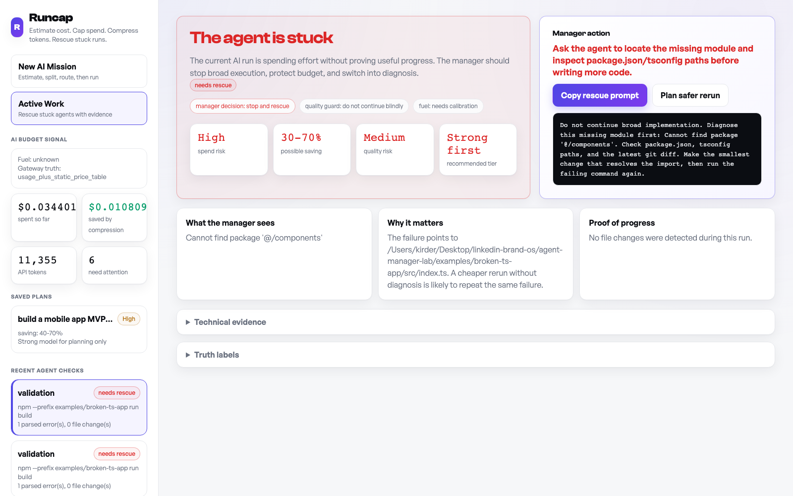

# Runcap

[](https://github.com/kirder24-code/ai-agent-manager/actions/workflows/ci.yml)



**Your AI coding agent re-reads the same files over and over and quietly burns your money. Runcap estimates the bill before you build, hard-caps the spend so it physically stops at your ceiling, and losslessly compresses every call. Free, MIT, 100% local. Your code and tokens never touch a server.**

On a real OpenAI call, one edited-file re-read dropped from **1,186 to 737 prompt tokens (37.9% saved)** with the model still answering correctly about the changed line. No other proxy does this:

| | Without Runcap | With Runcap |
|---|---|---|
| Re-read of an edited file | 1,186 prompt tokens | **737 prompt tokens** |
| You find out the cost | when the invoice arrives | **before you press go, capped at your ceiling** |
| When the agent gets stuck | it keeps spending | **run stops, you get the exact rescue prompt** |

> Every other tool here is a rear-view mirror - it shows you the bill *after* you paid it. Runcap estimates the bill *before* you start and caps it. It is a circuit breaker, not a dashboard.

> If Runcap caps a run for you or compresses a call, please **star the repo** - it is the one signal that tells me to keep building it in the open.

## Why

**Agents loop on the same error, rewrite plans, and re-read files they just edited - every loop is tokens you pay for.** Multi-agent coding runs burn roughly **15x more tokens** than a single chat ([Anthropic engineering](https://www.anthropic.com/engineering/built-multi-agent-research-system)). They hand you a confident summary while the task is not actually done, and you find out what it cost when the invoice - or the subscription limit - arrives.

Observability tools (Langfuse, Helicone, LangSmith, AgentOps) measure the past. Gateways (LiteLLM, Portkey, OpenRouter) route the present. None of them stop the spend *before* it happens. Runcap does the one thing the rear-view mirror can't:

```text
estimate before build  →  cap during run  →  compress every call  →  rescue when stuck
```

## The honest claim

Runcap does **not** promise an exact cost oracle. Agent trajectories are stochastic - nobody, including the model labs, can predict the exact token count of a run. So Runcap gives you a **range plus a hard cap**:

> "This build is roughly $3-7. Cap it at $10." - then it kills the run the second it hits the ceiling.

The range is the headline. The hard cap is the product.

## Who this is for

Runcap is a developer tool. It works by running a local gateway that your agent's API calls pass through, so it can price and cap them before they reach the paid provider. That means you need three things already in place:

- **Your own provider API key** (OpenAI or Anthropic). Runcap does not sell or supply model access.
- **Your own agent** - Claude Code, Codex, or any script that calls the OpenAI/Anthropic API.
- **Comfort running a CLI** and a local process on your machine.

If you have those, Runcap caps your spend in one command. If you are looking for a no-account web app that runs the AI for you, this is not that - it is a circuit breaker for a setup you already own.

## 60-second demo

No API key required.

```bash
git clone https://github.com/kirder24-code/ai-agent-manager.git
cd ai-agent-manager
npm run setup
npm run demo
```

**1. Catch a too-broad request before it spends anything:**

```text
$ runcap preflight -- claude "build the full mobile app with auth payments and production deploy"

Preflight: claude build the full mobile app with auth payments and production deploy
Scope risk: high
Fuel: 24% (medium confidence)
Recommendation: Do not launch as one broad mission. Split into one vertical slice with a verification command.
```

**2. Wrap a run - and get a rescue prompt the moment it gets stuck:**

```text
$ runcap run --label demo -- npm run build

Error [ERR_MODULE_NOT_FOUND]: Cannot find package '@/components' ...

Runcap mission: 20260601T221531-demo-ff42c0a
Status: stuck (medium confidence)
Exit code: 1
Changed files: 0
Parsed errors: 1
Primary recommendation: Resolve missing import before continuing feature work
```

The rescue report hands back a copyable prompt:

```text
Do not continue broad implementation. Diagnose this missing module first:
Cannot find package '@/components'. Check package.json, tsconfig paths, and
the latest git diff. Make the smallest change that resolves the import,
then run the failing command again.
```



## Install

```bash
npm install -g runcap     # exposes `runcap` (and `aim` as a legacy alias)
```

Or run from source with `node ./bin/runcap.mjs <command>`.

## Core commands

```bash
runcap plan --fuel 24 -- "build a small auth feature and verify it"   # range + recommended cap, before you spend
runcap preflight -- claude "build a full SaaS app"                     # is this prompt too broad?
runcap run --label fix -- claude "fix one failing check. stop if blocked."  # wrap any agent/command
runcap report                                                          # human-readable rescue report
runcap export                                                          # evidence JSON with truth labels
runcap dashboard                                                       # local cockpit at :8791
runcap gateway                                                         # cost-tracking proxy with hard budget cap
runcap fuel set 24                                                     # calibrate a %-only subscription
```

## The hard cap (gateway)

Point any OpenAI- or Anthropic-compatible tool at the local gateway. It records real token usage, prices it from a sourced table, and **blocks calls the moment your daily ceiling is hit**.

```bash
# OpenAI-compatible agents
OPENAI_API_KEY=sk-... AIM_DAILY_BUDGET_USD=5 runcap gateway
#   then: OPENAI_BASE_URL=http://127.0.0.1:8792/v1

# Anthropic-native (Claude Code, /v1/messages)
ANTHROPIC_API_KEY=sk-ant-... AIM_DAILY_BUDGET_USD=5 runcap gateway
#   then: ANTHROPIC_BASE_URL=http://127.0.0.1:8792/v1

# DeepSeek (OpenAI-compatible, much cheaper - same one command)
OPENAI_API_KEY=sk-... AIM_UPSTREAM_BASE_URL=https://api.deepseek.com AIM_DAILY_BUDGET_USD=5 runcap gateway
#   then point your agent at: OPENAI_BASE_URL=http://127.0.0.1:8792/v1  (model: deepseek-chat)
```

When spend crosses the ceiling, the next call returns `429 budget_guard` instead of money leaving your account. Try it with no key: `runcap gateway --mock`.

## Token compression (built in, no extra deps)

Every request that passes through the gateway is compressed before it's forwarded. Three layers, all **lossless by construction** - your prose instructions and code semantics are never altered, only machine "garbage" is trimmed:

1. **Per-field trim** - embedded JSON re-serialized compactly, long log/stack-trace dumps collapsed to head + tail, trailing whitespace squeezed.
2. **Identical-block dedup** - when the exact same file dump or tool_result ships again in the same request, the repeat is replaced with a deterministic stub.
3. **Delta-encoding of near-duplicates** - the layer no other proxy has. When the agent reads a file, edits one line, and re-reads it, the block is *similar but not identical*, so plain dedup saves nothing. Runcap sends a readable line-diff against the version the model already saw, and the model reconstructs the current file from it. On a real OpenAI call, an edited-file re-read dropped from **1186 to 737 prompt tokens - 37.9% saved, with the model still answering correctly about the changed line.** Proof and reproduction steps: [docs/delta-encoding-evidence.md](https://github.com/kirder24-code/ai-agent-manager/blob/main/docs/delta-encoding-evidence.md).

It's pure Node with **zero ML or native dependencies**, so it installs everywhere without the build pain heavier compressors have.

The dashboard shows the result as one number: **"You saved $X · N tokens compressed · would have spent $Y."** Disable it with `AIM_COMPRESS=off` if you ever want raw passthrough.

## Loop detection (the "looks productive but stuck" signal)

The hard case in stuck-detection is the agent that keeps producing output but is really circling the same failure, just reworded each time. Plain hashing misses it because the prompt is *similar but never byte-identical* between loops. Because the gateway sees every request, Runcap compares each request's conversation shape against the recent run with the same line-similarity primitive the delta-encoder uses: when several prompts in a row are near-identical (default: 3 prompts at 92%+ similarity) while the conversation never moves forward, it flags `loop.looping` on the event, surfaces a warning in `runcap status`, and fires an alert.

This is a **calculated** signal, not a proven dollar-saving: it tells you *"the agent has sent 3 near-identical prompts in a row with no progress"* so you can step in before the loop burns more budget. Tune or disable it with `AIM_LOOP_DETECT=off`. (Today's [`detectStuck`](src/mission-control.mjs) post-run score is outcome-based: exit code, parsed errors, and zero-diff. The loop signal adds the missing in-flight behavioral signal on top of it.)

## Pricing table

Costs are calculated from a sourced multi-provider table - Anthropic (Opus / Sonnet / Haiku), OpenAI (GPT-5 family + legacy GPT-4), and DeepSeek (V4 Flash / V4 Pro) - with cache-read and batch discounts handled, labeled with source and verification date. When a model is unknown, Runcap says `unknown_price` rather than guessing.

DeepSeek matters because its API is OpenAI-compatible: point the gateway at `https://api.deepseek.com` with your DeepSeek key and Runcap prices, caps, and compresses it with zero extra setup - the same one command as OpenAI. At roughly $0.14 / $0.28 per million input/output tokens it is far cheaper than the US frontier models, so the people running the biggest agent loops on it are exactly the ones a hard cap protects.

## Trust model

Runcap is built not to fake certainty. Every important output carries a truth label:

- `observed` - git diff, exit code, file changes, terminal output;
- `calculated` - parsed errors, diff hashes, stuck score, cost from the sourced price table;
- `provider_usage` - token usage returned by the upstream provider;
- `manual_calibration` - subscription % you entered before/after a run;
- `unknown` - Runcap cannot honestly know.

If it cannot prove something, it says so.

## Pricing (the product, not the tokens)

| Tier | Price | What you get |
|---|---|---|
| **OSS** (MIT, local) | $0 forever | All local runs, cost estimation, hard cap, run wrapping, stuck detection, rescue prompts, local dashboard. Never crippleware. |
| **Founding Pro** (limited) | **$49 once** | Lifetime Pro at the founder price - pay once, keep Pro forever, before it moves to $19/mo. |
| **Pro** | $19/mo | Cloud sync across machines, hosted dashboard, estimate-vs-actual trends, shareable reports, alerts on cap breach |
| **Team** | $49/seat/mo | Shared budget pools, org-wide ceilings, per-project rollups, role-based caps |

The local core is free forever. Only persistence, collaboration, and aggregation are paid - the things that only matter once data leaves your laptop.

## Current stage

A working local tool, not a hosted SaaS. Ready for: wrapping real Codex / Claude / Cursor sessions, catching stuck agents, and proving rescue prompts save time. Not yet: a hosted cloud platform or a universal observability standard. It is not trying to replace Langfuse or LiteLLM - it does the thing they don't.

## Documentation

- [Product status](PRODUCT.md)
- [Quickstart](docs/quickstart.md)
- [Roadmap](docs/ROADMAP.md)
- [Business plan](docs/BUSINESS-PLAN.md)
- [Integrations](docs/integrations.md)
- [Trust model](docs/trust-model.md)

## Built by

Runcap is built and maintained by Kirill D., a solo AI and automation consultant based in Calgary, Canada. He helps solo SaaS founders and service businesses ship AI features that hold up in production - cost control, vibe-code audits, and reliable automation. More at [launchsoloai.com](https://launchsoloai.com).

---

The thesis: **AI agents need managers.**
